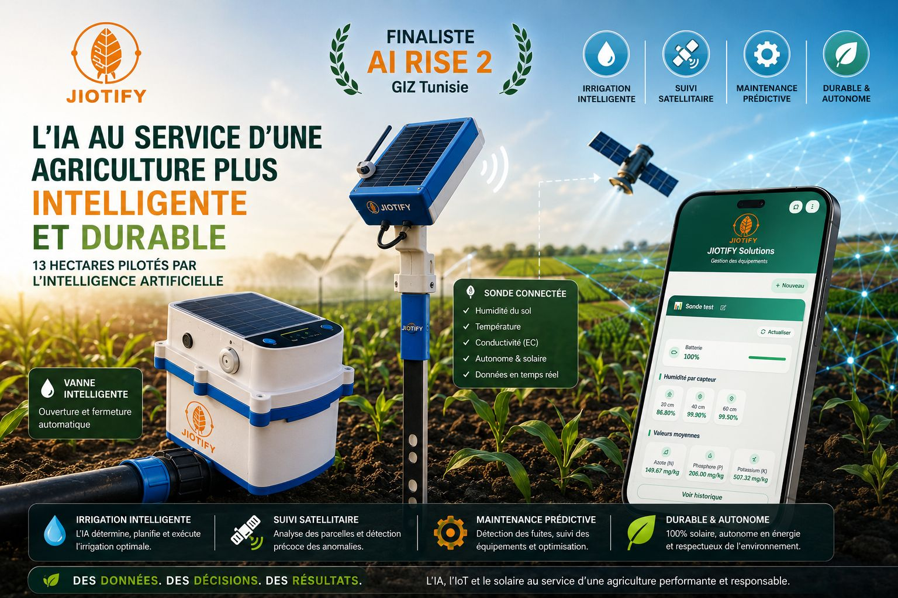

# GIZ-JIOTIFY-SOLUTIONS-Project-
 AI irrigation system for smallholder farmers — built with GIZ. Documentation-only showcase.
# Smart Irrigation System (GIZ Partnership) — Project Showcase

> **Note:** This repository is a documentation-only showcase. The source
> code, models, and field data belong to the project partners (GIZ and the
> host institution) and are not public due to confidentiality agreements.
> This page describes the system architecture, my role, and the engineering
> decisions — no proprietary code is included.

## Context

Finalist project developed in partnership with **GIZ** (Deutsche
Gesellschaft für Internationale Zusammenarbeit): a real-world deployment of
an autonomous irrigation system, combining physical infrastructure (soil
moisture probes, valves, pumps installed in the field) with a 
AI decision pipeline. The system is still under active development —
current work focuses on multi-agents , Edge AI, Reinforcement Learning, and Federated
Learning.

## Problem

Smallholder and mid-size farmers often over- or under-irrigate because
decisions are made on fixed schedules rather than actual plant/soil needs,
wasting both water and the energy used to pump it. The goal was to automate
that decision per tree, per plot, while respecting each farm's existing
(and often limited) irrigation infrastructure and minimizing electricity
cost.

## System architecture

```
┌───────────────────┐        (yes)      ┌────────────────────┐
│ Irrigation Need     │──────need?─────▶ │ Data Collection      │
│ Decision Agent       │                  │ (soil moisture,       │
│ (soil moisture,      │                  │  temperature, tree     │
│  tree type, age)     │                  │  age, phenological     │
└───────────────────┘                  │  stage, ET0,           │
        ▲ (no)                          │  precipitation)        │
        │                                └──────────┬─────────┘
   no action                                          ▼
                                            ┌────────────────────┐
                                            │ Water Quantity       │
                                            │ Prediction Model     │
                                            │ (ML) — liters needed │
                                            │ per tree              │
                                            └──────────┬─────────┘
                                                       ▼
                                            ┌────────────────────┐
                                            │ Irrigation Plan       │
                                            │ Generator             │
                                            │ (per plot, built on   │
                                            │  the farmer's actual   │
                                            │  hardware: valves,     │
                                            │  pumps — avoids grid    │
                                            │  peak hours to save    │
                                            │  energy)                │
                                            └──────────┬─────────┘
                                                       ▼
                                            ┌────────────────────┐
                                            │ Remote Control Web    │
                                            │ Application            │
                                            │ (executes plans,       │
                                            │  + satellite-based      │
                                            │  recommendations &      │
                                            │  alerts per plot)       │
                                            └────────────────────┘
```

**Pipeline, step by step:**

1. **Irrigation Need Decision Agent** — for each plot , decides whether
   irrigation is needed at all, based on sub-soil moisture, tree species,
   and tree age. If not, the pipeline stops here.
2. **Data collection** — if irrigation is needed, the agent gathers the
   relevant variables: sub-soil moisture, temperature, tree age,
   phenological (growth) stage, evapotranspiration, and precipitation...
3. **Water Quantity Prediction Model (ML)** — takes that data and predicts
   the exact volume of water required per tree.
4. **Irrigation plan generation** — the system builds a per-plot irrigation
   plan based on the farmer's actual installed hardware (which valves,
   which pumps are available on that specific plot), deliberately avoiding
   grid peak hours (STEG) to reduce the energy cost of pumping.
5. **Remote control web application** — the plan is executed through a web
   app we built for farmers to monitor and control their irrigation
   infrastructure remotely. The app also surfaces plot-level
   recommendations and alerts derived from satellite vegetation/soil
   coefficients, independent of the sensor-based pipeline above.
## 📸 Field Deployment

<p align="center">
  
</p>
## 📸 Field Deployment

<p align="center">
  
</p>
## Current research direction (ongoing)

The project is moving from a fixed pipeline toward a distributed,
self-improving, and more autonomous one:

- **Multi-agent system** — evolving the current linear pipeline into a set
  of cooperating agents (need detection, prediction, planning, monitoring)
  that can coordinate and negotiate rather than just executing a fixed
  sequence — closer to true agentic decision-making per plot.
- **Edge AI network** — pushing inference closer to the field devices
  instead of relying on a single central model, for lower latency and
  resilience to connectivity issues.
- **Reinforcement Learning** — reframing the irrigation scheduling problem
  as a sequential decision problem, so the system can learn better
  long-term watering strategies instead of just reacting to the current
  reading.
- **Federated Learning** — updating the global prediction model using data
  collected across multiple plots/farms without centralizing the raw
  sensor data, then periodically retraining and redistributing the model.

## My role

- Designed and implemented the multi-agent decision pipeline (need
  detection → data collection → water quantity prediction → irrigation
  plan generation).
- Implemented  the water quantity prediction model (feature engineering
  around soil, climate, and phenological variables).
- developed  the remote control web application (irrigation execution,
  satellite-based recommendations and alerts per plot).
- Currently working on the Edge AI / Reinforcement Learning / Federated
  Learning components of the next iteration.

## Status

🔧 Active project — finalist stage, still under development with GIZ.

## Why there's no code here

The implementation, trained models, and field sensor data are covered by
confidentiality agreements with GIZ and the participating farms. This
repository exists so the architecture and approach can still be discussed
and reviewed publicly, without exposing anything proprietary.
<p align="center">
  
</p>
